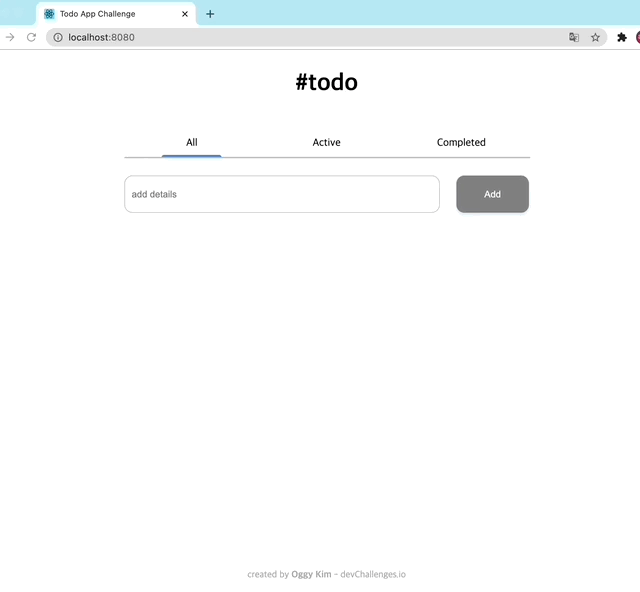
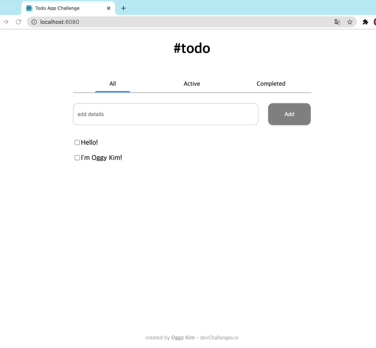
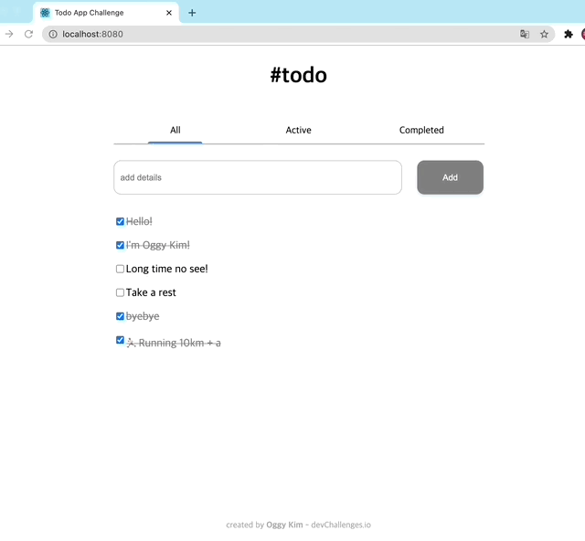
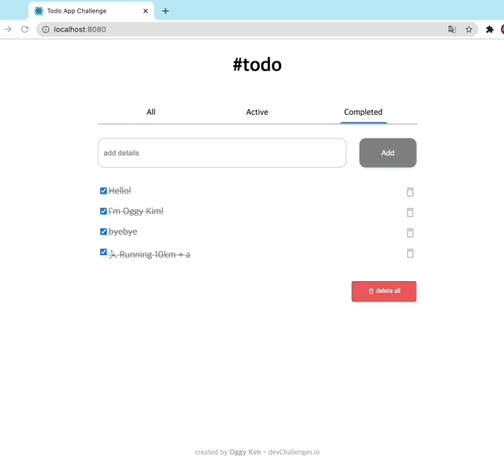
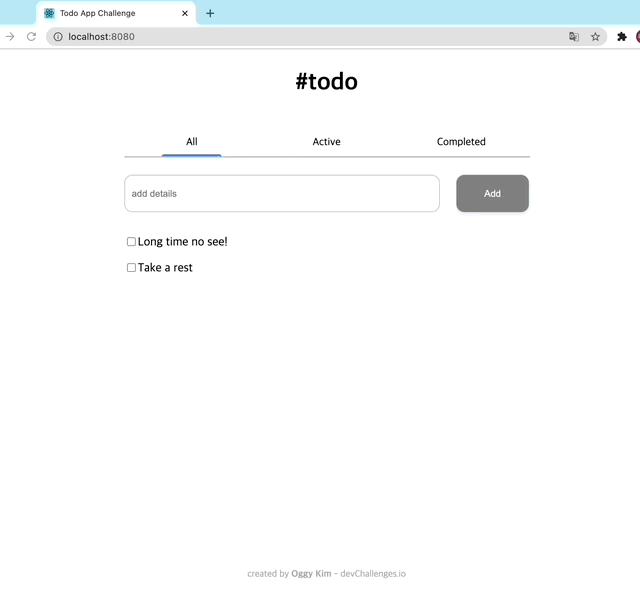

# Todo app Challenge(devchallenges.io)

[Challenge Link](https://devchallenges.io/challenges/hH6PbOHBdPm6otzw2De5)

- How to run

```terminal
npm i
npm run start
```

## Story

**Challenge**: Create a todo app following given designs. Use Front-end libraries like React or Vue. Don’t look at the existing solution. Fulfill user stories below:

- User story: I can add a new task



- User story: I can complete a task



- User story: I can toggle between All, Active and Completed



- User story: I can remove one or all tasks under the Completed tab



- User story (optional): Store the data in local storage that when I refresh the page I can still see my progress



## Skill

- React

  - All components are **functional components** with hooks.

  - **css**: CSS-in-JS(`styled-components`)

  - **Form action**, **state management**: use basic feature(prop drilling, useState)

    -> because this site doesn't need a lot of common state use. So, I use just 1 additional css library.

- Typescript

  - use 2 basic types(`todoType`, `selectedMenuType`) and basic type definitions(interface for props, function arguments).

### Have a nice day! 👨🏻‍💻
